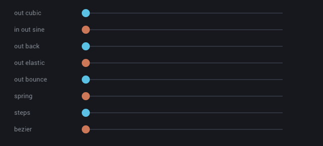
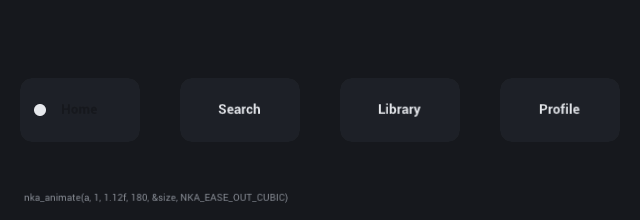
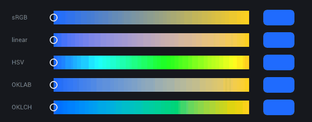
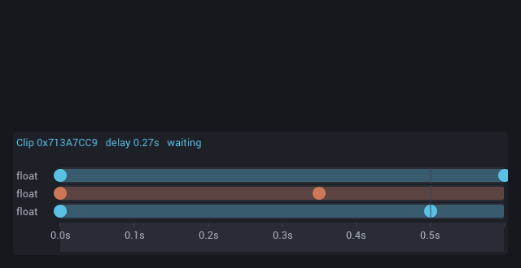
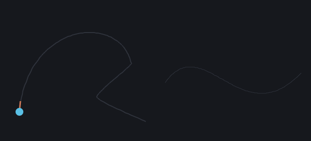
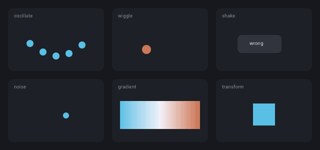
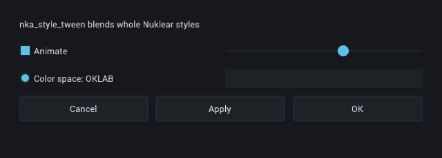
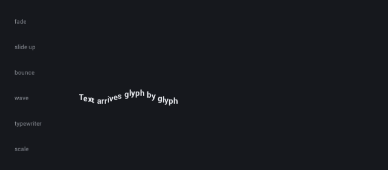

# NukAnim

Animation for [Nuklear](https://github.com/Immediate-Mode-UI/Nuklear) in one C99 header, which includes
`<math.h>` and nothing else (and `<stdlib.h>` only for Nuklear's default allocator). It is a port of
[ImAnim](https://github.com/soufianekhiat/ImAnim) by Soufiane Khiat, with the hover idiom of
[ImAnimate](https://github.com/RaidcoreGG/ImAnimate) by Raidcore.



## Use

```c
#include "nuklear.h"
#define NUKANIM_IMPLEMENTATION /* in one C file */
#include "nukanim.h"

struct nka_context *anim = nka_create(NULL); /* malloc, under NK_INCLUDE_DEFAULT_ALLOCATOR */

/* Every frame, before the UI: */
nka_update(anim, dt);

float alpha = nka_tween_float(anim, nka_id("panel"), nka_id("alpha"), open ? 1.0f : 0.0f, 0.25f,
                              nka_ease(NKA_EASE_OUT_CUBIC), NKA_POLICY_CROSSFADE, 0);

/* After it: an app that only draws on input keeps drawing while something moves. */
if (nka_busy(anim)) request_frame();
```

## What it does

**Tweens** of floats, vectors, ints and colors, keyed by an id and a channel, with crossfade, cut, queue,
additive and multiply policies; targets relative to a window, computed by a callback, or eased per axis.

**Easing**: the thirty classic curves, steps, cubic béziers, springs and your own functions. ImAnimate's
curves are among them, and so is its way of animating a value that keeps its own state:

```c
static float size = 1;
if (nk_input_is_mouse_hovering_rect(&ctx->input, bounds))
    nka_animate(anim, 1, 1.1f, 150, &size, NKA_EASE_OUT_CUBIC);
else
    nka_animate(anim, 1.1f, 1, 250, &size, NKA_EASE_OUT_CUBIC);
```



**Colors** blend in sRGB, linear sRGB, HSV, OKLAB or OKLCH.



**Clips**: keyframed timelines with loops, delays, markers, staggering across lists and grids, variation
from loop to loop, layering and chaining. They save to and load from memory.



**Paths**: lines, béziers and Catmull-Rom splines to move along at constant speed, morph between, and set
text on.



**Procedural motion**: oscillators, shake, wiggle, noise, gradients, 2D transforms and drag snapping.



**Nuklear**: eased scrolling for windows and groups, whole-style crossfades, text that arrives glyph by
glyph, and an inspector window with clip timelines and a profiler. Tested with Nuklear 4.13.3.





## Differences from ImAnim

- A context you create holds the state, instead of globals; `nka_update(anim, dt)` once a frame replaces
  the `dt` of every call, and `nka_busy` tells an app that only draws on input when to keep going.
- Nuklear cannot turn text: glyphs on a path stay upright, and the rotate effect fades. Scaled text needs
  a backend that draws Nuklear's vertex output.
- Parametric curves are computed exactly rather than read from lookup tables.
- Clip files became buffers you read and write yourself, little-endian and checksummed.
- Bugs fixed on the way, among them: the queue policy only waited a frame, additive tweens added their
  delta every frame, garbage collection dropped tweens in use, back and elastic curves ignored their
  parameters, finite loops never ended, markers at the end of a clip never fired, finished gradient,
  transform, morph and style tweens restarted forever, noise channels sampled the noise where it is
  flattest, and shakes only shook one axis.

## Tests

```sh
git submodule update --init
cmake -S . -B build && cmake --build build && ctest --test-dir build
```

`build/clips` renders the clips above, run from the repository's root; `tools/gif.py` makes them GIFs.

## License

MIT. [LICENSE](LICENSE) keeps ImAnim's and ImAnimate's notices.
